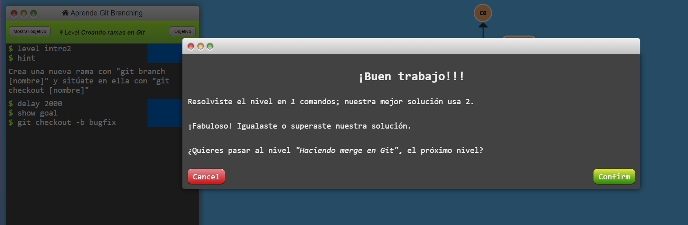

# hmis-repo01
## arq658
### Me llamo Alberto pero generalmente online se me encuentra como Vatalefort
### Primer nivel de git branching  

  
### Segundo nivel de git branching  

  
### Tercer nivel de git branching  

  
### Cuarto nivel de git branching  

  
### Quinto nivel de git branching  

  
### Primer Nivel remoto de git branching  

  
### Segundo Nivel remoto de git branching  

  

